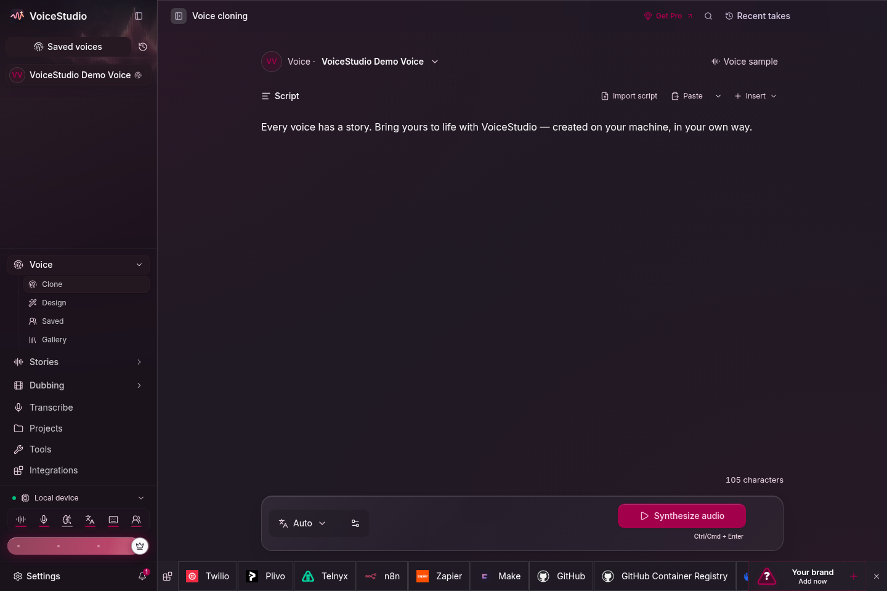
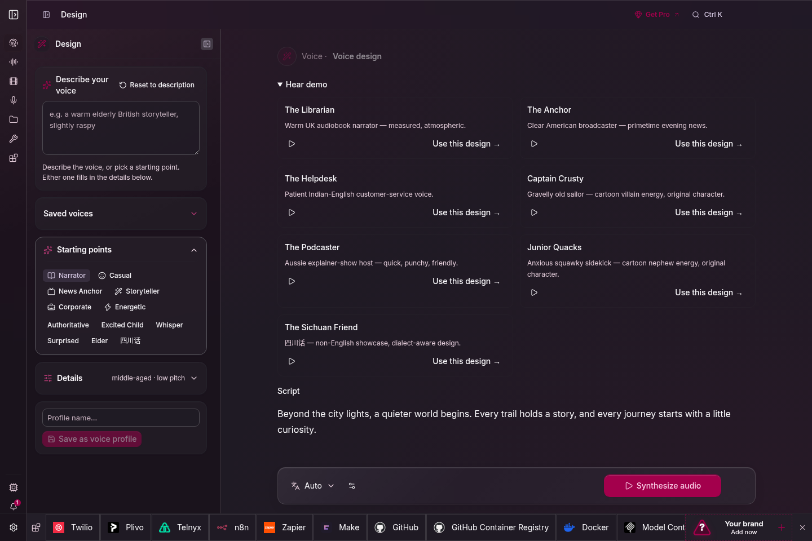

<div align="center">
  
  <h1>VoiceStudio</h1>
  <p>
    <a href="https://trendshift.io/repositories/28176?utm_source=repository-badge&amp;utm_medium=badge&amp;utm_campaign=badge-repository-28176" target="_blank" rel="noopener noreferrer"></a>
  </p>
  <p><sub>Previously OmniVoice-Studio</sub></p>
  <h3>Local voice cloning, dubbing, dictation, and long-form audio.</h3>
  <p>18 TTS engines · 11 ASR engines · 646-language catalogue · macOS, Windows, and Linux</p>
  <p><strong>Local-first.</strong> No account, API key, subscription, or usage meter for the core workflow.</p>

  <p><strong>Open-source voice cloning, voice design, video dubbing, dictation, transcription & audiobook creation in 646 languages.</strong></p>
  <p>
    <a href="https://voicestudio.sh/?utm_source=github&utm_medium=readme&utm_campaign=project">Website</a> ·
    <a href="https://github.com/debpalash/VoiceStudio/releases/latest">Download</a> ·
    <a href="#get-started">Get started</a> ·
    <a href="#documentation">Docs</a> ·
    <a href="https://discord.gg/bzQavDfVV9">Discord</a> ·
    <a href="README_CN.md">简体中文</a>
  </p>
  <p>
    <a href="https://github.com/debpalash/VoiceStudio/actions/workflows/ci.yml"></a>
    <a href="https://github.com/debpalash/VoiceStudio/stargazers"></a>
    <a href="https://github.com/debpalash/VoiceStudio/releases"></a>
    <a href="https://github.com/debpalash/VoiceStudio/releases/latest"></a>
    <a href="LICENSE"></a>
    <a href="https://discord.gg/bzQavDfVV9"></a>
  </p>

  <p>
    <a href="https://github.com/TheOneironaut/VoiceStudio/releases/download/gemini-windows/VoiceStudio-Gemini-Windows-x64.msi"></a>
  </p>

  <p>
    <a href="https://github.com/TheOneironaut/VoiceStudio/actions/workflows/gemini-windows-msi.yml"></a>
  </p>
</div>


## Your voice. Your workflow.

> [!NOTE]
> **Gemini edition.** New installations use **Gemini 3.1 Flash TTS Preview** by default. Set `GEMINI_API_KEY` or `GOOGLE_API_KEY` before generating speech. VoiceStudio does not download a local TTS checkpoint unless you explicitly select a local engine; an existing saved engine choice is preserved.

## At a glance

| | VoiceStudio |
|---|---|
| **Workflows** | Voice cloning and design, video dubbing, dictation, stories, audiobooks, batch generation |
| **Language catalogue** | 646 TTS languages; actual coverage and quality depend on the selected engine |
| **Engines** | 18 TTS · 11 ASR · switch in Model Catalogue or with <kbd>Ctrl</kbd>/<kbd>Cmd</kbd>+<kbd>E</kbd> |
| **Platforms** | macOS 13.3+ on Apple Silicon · Windows 10/11 x64 · Linux x86_64 with glibc 2.39+ |
| **Compute** | CUDA · Apple Silicon MPS/MLX · ROCm on Linux · CPU · optional remote workers |
| **Interfaces** | Desktop app · local REST/SSE/WebSocket API · OpenAI-compatible audio API · MCP Server |
| **Storage** | Voices, projects, settings, and outputs stay on the machine by default |
| **License** | AGPL-3.0 application; downloaded models keep their upstream terms |

| Create | Produce | Connect |
| :--- | :--- | :--- |
| Clone a voice or design your own | Dub videos with timed speech | Local API & MCP for agents |
| Dictate with a floating widget | Stories, audiobooks & batch jobs | Optional remote workers |

Start with **VoiceStudio** (default, powered by k2-fsa/OmniVoice), or choose another engine. [Features & engine catalog](docs/feature-catalog.md).

Local workflows run on your hardware. Remote services are optional; usage analytics requires consent.

<details>
<summary><strong>Explore the workspaces</strong> · Clone, dub, design & models</summary>

<table>
  <tr>
    <td></td>
    <td></td>
  </tr>
  <tr><td align="center">Voice cloning</td><td align="center">Video dubbing</td></tr>
  <tr>
    <td></td>
    <td></td>
  </tr>
  <tr><td align="center">Voice design</td><td align="center">Local models</td></tr>
</table>


</details>

## Get started

Download from [Releases](https://github.com/debpalash/VoiceStudio/releases/latest), then follow your platform guide:

**[macOS](docs/install/macos.md) · [Windows](docs/install/windows.md) · [Linux](docs/install/linux.md) · [Docker](docs/install/docker.md)**

| Platform | Package | Guide |
|---|---|---|
| macOS 13.3+ | Apple Silicon DMG | [Install on macOS](docs/install/macos.md) |
| Windows 10/11 | [Gemini x64 MSI](https://github.com/TheOneironaut/VoiceStudio/releases/download/gemini-windows/VoiceStudio-Gemini-Windows-x64.msi); current-user install without admin access | [Install on Windows](docs/install/windows.md#install-pre-built-msi) |
| Linux | AppImage, x86_64 with glibc 2.39+ | [Install on Linux](docs/install/linux.md) |
| Docker | Linux/AMD64 images; CUDA, ROCm, CPU, and worker-only GPU profiles | [Run with Docker](docs/install/docker.md) |

Download this fork's [Windows Gemini MSI](https://github.com/TheOneironaut/VoiceStudio/releases/download/gemini-windows/VoiceStudio-Gemini-Windows-x64.msi). First launch creates a managed Python environment, but the Gemini default does not download local TTS model weights. Local engines remain available as an explicit choice.

Open **Voice cloning**, choose a voice or add a clean reference recording, enter your text, and generate. Install the required model when prompted. Hardware needs vary by engine; see [performance](docs/performance.md).

### Install with prompt

Copy this prompt into your coding agent to install VoiceStudio and configure it for your device:

```text
Install and configure the VoiceStudio Electron desktop app on this device,
then verify it works. Tauri is archived; do not install or launch it.
Repository: https://github.com/debpalash/VoiceStudio

Read the repository's install guide for my OS, docs/performance.md, and
skills/voicestudio/SKILL.md. Install the voicestudio audio-workflow skill
with `npx skills add debpalash/VoiceStudio` if your agent supports skills;
otherwise follow that SKILL.md directly.

Detect my OS, CPU architecture, GPU, available RAM/VRAM, free disk space,
and any existing VoiceStudio installation, backend, or downloaded models.
Reuse existing data and models. Prefer the latest stable Electron installer
for my OS and architecture; select an asset named VoiceStudio-Electron.
For source setup, follow electron/README.md: bun install, bun run setup:api, then bun run dev
from the repository root. Let Electron supervise the backend; do not start
a second backend or use legacy tauri scripts.
If migrating from Tauri, follow docs/electron-migration.md and back up first.

Configure local voice cloning using a supported engine and acceleration
that fit this device. Keep working defaults and verify the actual execution
device rather than assuming GPU support. Install required dependencies;
reuse a suitable installed model, or explain the download size and license
and ask before downloading one. Keep cloud services and analytics opt-in.

Start the app, check /health at the configured backend address (default
http://localhost:3900), and discover its API through /openapi.json. Generate
a short test with a bundled or authorized voice and verify the audio file.
Report the installed version, engine, actual device, data location, audio
output path, and how to reopen the app. Complete the setup, not just a plan;
identify any permissions or manual steps you cannot perform.
```

<details>
<summary><strong>Run the Electron preview from source</strong></summary>

```bash
git clone https://github.com/debpalash/VoiceStudio.git
cd VoiceStudio
bun install
bun run setup:api  # prepare Python dependencies before starting Electron
bun run dev
```

See [Electron setup](electron/README.md) for prerequisites and backend configuration.

Use `bun run smoke-test` to build and launch an isolated packaged Electron app.
Add `-- --install` for the networked managed-runtime installation check.

</details>

<a id="features"></a>

## Features

| Area | Included |
|---|---|
| **Voice Cloning** | Zero-shot synthesis from a short reference clip ([guide](docs/engines/README.md)) |
| **Voice Design** | Create a voice from age, accent, pitch, style, and delivery instructions ([expressive speech](docs/expressive-speech.md)) |
| **Video Dubbing** | Transcribe, translate, preserve speakers, synthesize, and export video; compact translation settings include track selection, and completed dubs flag timing issues for review ([export guide](docs/dubbing/export.md)) |
| **Stories and audiobooks** | Multi-voice scripts · EPUB/PDF import · chapter rendering · `.m4b` export |
| **[Dictation Widget](docs/features/dictation.md)** | System-wide shortcut, live transcription, optional local-LLM cleanup |
| **Vocal Isolation** | Demucs speech/background separation |
| **Speaker Diarization** | Pyannote and WhisperX speaker assignment ([guide](docs/features/diarization.md)) |
| **Batch Queue** | Queue large sets of audio and video jobs with per-job progress, or watch a local folder for new videos |
| **Model Catalogue** | Install, remove, select, and route TTS, ASR, and LLM models ([catalogue](docs/engines/README.md)) |
| **Remote Model Downloads** | Install models on enrolled remote workers with live progress ([guide](docs/downloading-models.md)) |
| **GPU Auto-Detect** | CUDA, MPS, ROCm, and CPU routing with per-engine checks ([performance](docs/performance.md)) |
| **AI Watermark** | AudioSeal embedding and detection |
| **MCP Server** | Synthesis and transcription tools for MCP clients ([guide](docs/mcp.md)) |
| **Diagnostics** | Self-checks, error journal, logs, and scrubbed support bundles ([troubleshooting](docs/install/troubleshooting.md)) |
| **Local-first** | Core creation stays local; network-backed features are explicit opt-ins |
| **Extensible** | Registry-based TTS, ASR, and plugin interfaces ([acceptance](docs/engine-acceptance.md)) |

<table>
<tr>
  <td width="50%"></td>
  <td width="50%"></td>
</tr>
<tr>
  <td align="center"><sub>Model Catalogue: engine, device, and install state</sub></td>
  <td align="center"><sub>Gallery: save a shared voice as a local profile</sub></td>
</tr>
</table>

<a id="comparison"></a>

## Comparison

VoiceStudio trades managed cloud compute for local control. This is the practical difference:

| | **VoiceStudio** | **Typical hosted voice service** |
|---|---|---|
| **Best fit** | Private, offline, self-hosted, or high-volume work | Fast setup without local model management |
| **Data path** | Local by default; remote features are opt-in | Audio and text are processed by the provider |
| **Cost model** | Free software; you supply the hardware | Subscription, credits, or metered API use |
| **Setup** | Install the app and model weights | Create an account and use the web app or API |
| **Performance** | Depends on your engine and hardware | Provider manages compute and scaling |
| **Offline use** | Yes, after required models are installed | Usually requires a network connection |
| **Customization** | Source, engines, models, API, and routing are open | Limited to provider options |
| **Maintenance** | You manage updates, disk, and compute | Provider manages infrastructure |

<a id="requirements"></a>

## Requirements

Requirements vary by engine. These values cover the default local workflow.

| | **Minimum** | **Recommended** |
|---|---|---|
| **OS** | Windows 10 x64 · macOS 13.3 Apple Silicon · Linux x86_64 with glibc 2.39+ | Current supported OS release |
| **RAM** | 8 GB | 16 GB+ |
| **Disk** | 10 GB free | 20 GB+ SSD |
| **GPU** | Optional; CPU mode is supported | NVIDIA CUDA or Apple Silicon |
| **VRAM** | 4 GB when using a GPU | 8 GB+; large optional engines need more |
| **Python from source** | 3.11+ | 3.11 or 3.12 |

ROCm is Linux-only and opt-in. Windows AMD/Ryzen AI uses CPU. Systems with limited VRAM offload work to CPU when required. See [performance](docs/performance.md), [benchmarks](docs/benchmarks.md), and [engine disk usage](docs/engines/disk-usage.md).

<a id="hardware-recommendations"></a>

### Recommended stack by hardware

| Hardware | Recommended TTS | Recommended ASR | Why |
|---|---|---|---|
| **Apple Silicon (M1–M4)** | [MLX-Audio](docs/engines/mlx-audio.md) · [OmniVoice](docs/engines/omnivoice.md) (MPS) | [MLX Whisper](docs/engines/mlx-whisper.md) · [Parakeet MLX](docs/engines/parakeet-mlx.md) | Native unified memory, lowest latency on macOS |
| **NVIDIA GPU (8 GB+ VRAM)** | [OmniVoice](docs/engines/omnivoice.md) · [CosyVoice 3](docs/engines/cosyvoice.md) | [WhisperX](docs/engines/whisperx.md) | High-fidelity zero-shot cloning, word timestamps, diarization |
| **Low VRAM / CPU-only** | [PocketTTS](docs/engines/pockettts.md) · [Sherpa-ONNX](docs/engines/sherpa-onnx.md) · [KittenTTS](docs/engines/kittentts.md) | [Moonshine](docs/engines/moonshine.md) · [Faster-Whisper](docs/engines/faster-whisper.md) (`int8`) | Low memory footprint, optimized CPU inference |

<a id="engines"></a>

## Engines

Engine support is capability-specific. Check cloning, language, platform, memory, and license before choosing one. Full setup guides: [docs/engines](docs/engines/README.md).

<a id="tts-engines"></a>

### Text to speech

| Engine | Languages | Clone | Instruct | Linux | macOS ARM | Windows | License |
|---|:---:|:---:|:---:|:---:|:---:|:---:|---|
| [**VoiceStudio** (default, powered by k2-fsa/OmniVoice)](docs/engines/omnivoice.md) | 600+ | Yes | Yes | CUDA/CPU | MPS | CUDA/CPU | [AGPL-3.0](LICENSE) app · [Apache-2.0 code, CC-BY-NC weights](https://huggingface.co/k2-fsa/OmniVoice#license)³ |
| [**CosyVoice 3**](docs/engines/cosyvoice.md) | 9 + 18 dialects | Yes | Yes | CUDA/CPU | CPU | CUDA/CPU | Apache-2.0 |
| [**GPT-SoVITS**](docs/engines/gpt-sovits.md) | 5 | Yes | No | CUDA/CPU | No | CUDA/CPU | MIT |
| [**VoxCPM2**](docs/engines/voxcpm2.md) | 30 | Yes | Yes | CUDA/CPU | MPS | CUDA/CPU | Apache-2.0 |
| [**MOSS-TTS-Nano**](docs/engines/moss-tts-nano.md) | 20 | Yes | No | CUDA/CPU | CPU | CUDA/CPU | Apache-2.0 |
| [**KittenTTS**](docs/engines/kittentts.md) | English | No | No | CPU | CPU | CPU | MIT |
| [**MLX-Audio**](docs/engines/mlx-audio.md) | Model-dependent | Varies | Varies | No | MLX | No | Varies |
| [**Sherpa-ONNX**](docs/engines/sherpa-onnx.md) | 20+ | No | No | CUDA/CPU | CPU | CUDA/CPU | Apache-2.0 |
| [**IndexTTS 2.5** ⚡](docs/engines/indextts.md) | ZH · EN · JA · ES · AR | Yes | No | CUDA/CPU | CPU | CUDA/CPU | Bilibili model license¹ |
| [**OmniVoice GGUF** ⚡](docs/engines/omnivoice-gguf.md) | 600+ | Yes | Yes | CUDA/CPU | MPS/CPU | CUDA/CPU | [AGPL-3.0](LICENSE) app · [review the derivative model terms](https://huggingface.co/Serveurperso/OmniVoice-GGUF#license)³ |
| [**OmniVoice (subprocess; opt-in off MPS)** ⚡](docs/engines/omnivoice-subprocess.md) | 600+ | Yes | Yes | CUDA/CPU | MPS via default OmniVoice | CUDA/CPU | [AGPL-3.0](LICENSE) app · [Apache-2.0 code, CC-BY-NC weights](https://huggingface.co/k2-fsa/OmniVoice#license)³ |
| [**PocketTTS** ⚡](docs/engines/pockettts.md) | EN · FR · DE · PT · IT · ES | Yes | No | CPU | CPU | CPU | CC-BY-4.0, gated² |
| [**Supertonic 3** ⚡](docs/engines/supertonic3.md) | 31 | No | No | CPU | CPU | CPU | OpenRAIL-M |
| [**MOSS-TTS-v1.5** ⚡](docs/engines/moss-tts-v15.md) | 31 | Yes | No | CUDA/CPU | CPU | CUDA/CPU | Apache-2.0 |
| [**dots.tts** ⚡](docs/engines/dots-tts.md) | 24 | Yes | No | CUDA/CPU | CPU | No | Apache-2.0 |
| [**Confucius4-TTS** ⚡](docs/engines/confucius4-tts.md) | 14 | Yes | No | CUDA/CPU | CPU | CUDA/CPU | Apache-2.0 |
| [**audio.cpp / Breeze-TTS-2** ⚡](docs/engines/audio-cpp.md) | EN · ZH | Yes | Yes | CPU/Vulkan | Metal/CPU | CPU/Vulkan/CUDA | Apache-2.0 code · BreezeBlue research/non-commercial weights |
| [**Gemini 3.1 Flash TTS Preview** ⚡](docs/engines/gemini-tts.md) | Multilingual | No | Yes | Cloud API | Cloud API | Cloud API | Google API terms |

⚡ Installed or registered on demand.

¹ IndexTTS 2.5 requires a separate written Bilibili license above 100 million monthly active users or RMB 1 billion annual revenue. Review the [model license](https://huggingface.co/IndexTeam/IndexTTS-2.5/blob/main/LICENSE).

² PocketTTS shows its gated-access and CC-BY-4.0 terms before first use.

³ The OmniVoice snapshot also includes an audio tokenizer under separate [Boson Higgs Audio 2 and Meta Llama community terms](https://huggingface.co/k2-fsa/OmniVoice/blob/main/audio_tokenizer/LICENSE). VoiceStudio's application license does not replace model or tokenizer terms.

Clone-less engines cannot preserve a reference speaker in dubbing or pinned-voice batch jobs. VoiceStudio rejects those jobs instead of silently changing engines. Heavy engines have separate memory and platform limits; check their engine guide first.

<a id="asr-engines"></a>

### Speech to text

| Engine | ID | Languages | Best fit |
|---|---|:---:|---|
| [**WhisperX** (default)](docs/engines/whisperx.md) | `whisperx` | ~100 | Dubbing, subtitles, word-level timing |
| [**Faster-Whisper**](docs/engines/faster-whisper.md) | `faster-whisper` | ~100 | General cross-platform transcription |
| [**Faster-Whisper (isolated)**](docs/engines/faster-whisper-isolated.md) | `faster-whisper-isolated` | ~100 | Crash-isolated batch transcription |
| [**MLX Whisper**](docs/engines/mlx-whisper.md) | `mlx-whisper` | ~100 | Apple Silicon |
| [**PyTorch Whisper**](docs/engines/pytorch-whisper.md) | `pytorch-whisper` | ~100 | CUDA, MPS, and CPU fallback |
| [**Parakeet TDT**](docs/engines/nemo-parakeet.md) | `nemo-parakeet` | English + 25 EU | Fast CPU/CUDA transcription |
| [**Parakeet TDT v3 (MLX)**](docs/engines/parakeet-mlx.md) | `parakeet-mlx` | 25 EU | Apple Silicon dictation and word timestamps |
| [**Moonshine**](docs/engines/moonshine.md) | `moonshine` | English | Low-power, low-latency ONNX |
| [**FunASR**](docs/engines/funasr.md) | `funasr` | 50+ | VAD and inline diarization |
| [**sherpa-onnx** (live dictation)](docs/engines/sherpa-onnx-asr.md) | `sherpa-onnx-asr` | Model-dependent | Streaming CPU dictation |
| [**OpenAI-compatible** ⚠️ configured server](docs/engines/openai-compatible-asr.md) | `openai-compat-asr` | Server-dependent | Local gigastt/Qwen3-ASR or a remote endpoint; audio goes only to that server |

WhisperX and Faster-Whisper retry with `int8` when efficient `float16` is unavailable. Pin `ASR_COMPUTE_TYPE=int8` or `float32` only if automatic selection still fails.

<a id="architecture"></a>

## Architecture

```text
Electron desktop shell
        │ typed preload bridge
React + Vite renderer
        │ HTTP · SSE · WebSocket on localhost:3900
FastAPI backend
        ├── TTS / ASR engine registries
        ├── dubbing / audio / long-form pipelines
        ├── OpenAI-compatible API and MCP server
        └── SQLite + Alembic → omnivoice_data/
```

| Layer | Path | Responsibility |
|---|---|---|
| Desktop shell | `electron/src/main/` | Window lifecycle, shortcuts, updater, and backend supervision |
| Frontend | `electron/src/renderer/` | React UI, API and event clients, i18n |
| API | `backend/api/` | REST routes, schemas, auth boundaries, streaming |
| Core services | `backend/services/` | Generation, dubbing, audio processing, persistence |
| Engines | `backend/engines/` | Isolated and optional engine adapters |
| Worker system | `backend/worker/` | Authenticated remote compute and job transport |
| Data | `omnivoice_data/` | Projects, voices, settings, logs, and SQLite state |
| Delivery | `scripts/`, `deploy/`, `.github/workflows/` | Development, packaging, containers, releases, CI |

### Network boundary

- The desktop talks to a loopback-only backend on `localhost:3900`.
- Loopback API calls need no server key. Remote access requires a share PIN or API key.
- Remote workers and OpenAI-compatible ASR are opt-in. Loopback ASR may use HTTP and keeps audio on the machine; non-loopback endpoints require HTTPS, and redirects are not followed.
- Analytics is off until consent. If enabled, it sends allowlisted, content-free usage metadata. It never sends text, audio, file names, or projects.

<a id="api"></a>

## Local speech platform and OpenAI-compatible API

Point an OpenAI-compatible audio client at the local backend:

```diff
- base_url="https://api.openai.com/v1"
+ base_url="http://localhost:3900/v1"
```

| Endpoint | Purpose |
|---|---|
| `POST /v1/audio/speech` | TTS to `mp3`, `opus`, `aac`, `flac`, `wav`, or `pcm`; select a profile with `voice` and an engine with `model` |
| `POST /v1/audio/transcriptions` | STT to `json`, `text`, `verbose_json`, `srt`, or `vtt` |
| `WS /v1/audio/transcriptions/stream` | Live PCM/WebM transcription with partial, utterance, and session-final events |
| `GET /.well-known/voicestudio-speech` | Discover HTTP, WebSocket, MCP, and native dictation-control transports |
| `GET /v1/audio/voices` | List local voice profiles and engines |

```python
from openai import OpenAI

client = OpenAI(base_url="http://localhost:3900/v1", api_key="local")

with client.audio.speech.with_streaming_response.create(
    model="tts-1",
    voice="<profile-id>",
    input="Made on my own hardware.",
    response_format="wav",
) as response:
    response.stream_to_file("speech.wav")
```

```bash
# Quick test via cURL
curl http://localhost:3900/v1/audio/speech \
  -H "Content-Type: application/json" \
  -d '{"model": "tts-1", "input": "Made on my own hardware.", "voice": "default", "response_format": "wav"}' \
  --output speech.wav
```

The bundled Rust control sidecar lets Herdr, coding agents, VS Code, desktop apps,
and TUIs trigger the system-wide dictation flow or reuse its native text
insertion. See the [speech platform guide](docs/speech-platform.md). The full API
reference is in **Settings → OpenAPI Reference**. For LAN, Tailscale, or proxy
access, read [API authentication](docs/api-auth.md) before exposing the backend.

### Agent skills

Install the VoiceStudio skills for Claude Code, Codex, Cursor, and other [skills.sh](https://skills.sh)-compatible agents:

```bash
npx skills add debpalash/VoiceStudio
```

- `omnivoice`: synthesize speech and transcribe audio through local VoiceStudio.
- `oss-maintainer`: the repository's open-source maintenance workflow.

### Model Context Protocol (MCP)

VoiceStudio mounts an MCP server at `http://localhost:3900/mcp` for Claude Desktop, Cursor, and AI agents:

```json
{
  "mcpServers": {
    "voicestudio": {
      "url": "http://localhost:3900/mcp"
    }
  }
}
```

For clients requiring stdio transport, use the bundled local shim (`docs/mcp.json`):

```json
{
  "mcpServers": {
    "voicestudio": {
      "command": "python",
      "args": ["-m", "backend.mcp_shim"],
      "cwd": "/path/to/VoiceStudio"
    }
  }
}
```

See the [MCP guide](docs/mcp.md) for tools (`generate_speech`, `clone_voice`, `transcribe`), file streaming modes, and client bindings.

### Google Colab

[](https://colab.research.google.com/github/debpalash/VoiceStudio/blob/main/notebooks/OmniVoice_Studio_Colab.ipynb)

The [notebook](notebooks/OmniVoice_Studio_Colab.ipynb) runs the app and web UI on a Colab GPU. Colab is remote compute, so uploaded audio and project data do not remain local to your machine.

<a id="documentation"></a>
> **Electron is the only maintained desktop app.** Version 0.5.3 was the final Tauri release. Existing Tauri users must [install Electron separately](docs/electron-migration.md). Root development, build, test, and release commands target Electron; Tauri source is archived and receives no further updates.

## Documentation

| Need | Start here |
|---|---|
| Setup help | [Troubleshooting](docs/install/troubleshooting.md) · [Model downloads](docs/downloading-models.md) |
| Models & audio quality | [Engine guides](docs/engines/README.md) · [Benchmarks](docs/benchmarks.md) |
| Integrations | [Local API](docs/speech-platform.md) · [MCP](docs/mcp.md) · [Examples](examples/README.md) |
| Development | [Contributing](.github/CONTRIBUTING.md) · [Electron](electron/README.md) · [Changelog](CHANGELOG.md) |

Agent skills: `npx skills add debpalash/VoiceStudio` — choose **voicestudio** for audio workflows or **voicestudio-maintainer** for repository maintenance.

## Sponsors

<a href="https://forms.gle/2PYCvd39hbwijzX37"></a>

**Become a featured partner.** [Apply for a paid placement](https://forms.gle/2PYCvd39hbwijzX37) · [Email us](mailto:partner@voicestudio.sh)

Support development: [Ko-fi](https://ko-fi.com/debpalash) · [PayPal](https://paypal.me/palashCoder) · [Sponsorship details](SPONSORS.md)

## License & responsible use

[AGPL-3.0](LICENSE). Models have their own licenses; review them before commercial use. Clone voices only with permission. See [license details](LICENSE-NOTICE.md).
